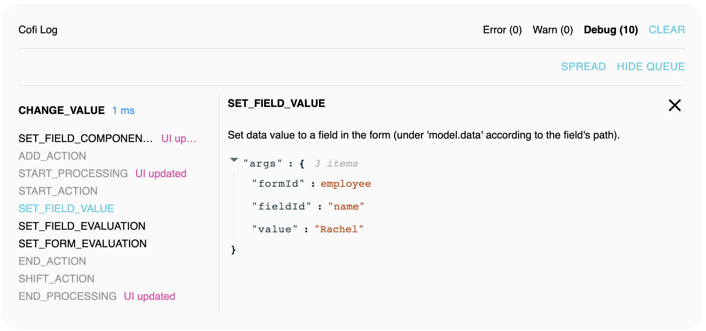
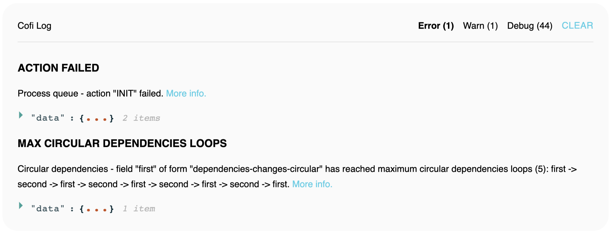

## TBD - Chrome Extension

In addition to Cofi's console logs of `error`, `info` and `debug` messages - Cofi chrome extension
lets developers see Cofi's log messages and understand form's lifecycle process in a more convenient way.

Similar layout to the `Log` component which appears on [React Form Demos](https://galhavivi.github.com/cofi/demo-react-form.html).

> **Note:** Another way to see logs without Chrome extension, is to import `LogProvider` and `Log` components,
and render them in your App.
```javascript
import { LogProvider, withLog } from '@cofi/react-form';
import Log from '@cofi/react-components/form/Log';

const CofiLog = withLog(Log);

const settings = { 
  debugMaxLength: 50, 
  errorMaxLength: 10, 
  warnMaxLength: 10,
  formIds: undefined, // pass array of formIds to log only records which belongs to them
};

<Root>
  <App>
  <LogProvider settings={settings}>
    <CofiLog />
  </LogProvider>
</Root>
```

### Debug

Debug tabs shows Cofi's debug messages.



#### By Action

`Aggregate view` - displays form debug messages aggregated by actions, and ordered according to the order that they were called.
Each action displays its lifecycle steps, ordered according to the time they were called in the scope of the action.
When using more that 1 form - its possible to see actions from different forms in the log, since Form's actions queue is instance based
and Cofi's log is a shared tool between instances.
This can also occur when redirecting from a page that have a form - to another pages that renders another form.

#### By Step

`Spread view` - displays debug messages, ordered by the time they were called. 
Each message is a step of an action in the form's lifecycle.
When using more that 1 form - its possible to see steps from different forms in the log, since Form's actions queue is instance based
and Cofi's log is a shared tool between instances.

#### Hide Queue Messages

`Hide queue` - hides actions queue debug messages. Helps to focus on the actual steps that alters the form store.

#### Action / Step Tooltips

Hover an action / step to display the data that was passed to the action / step.
To track how data was changed in the form - simply hover the steps quickly, without the need
to click them to see their details.

#### Action / Step Details

Click an action / step to display the data that was passed to the action / step in a separated section.
Data is viewable via json viewer.

### Warn

Displays form warnings. Each warning contains a message, and related data.


### Error

Displays form errors. Each error contains an error code, message, related data, sub error and reference to the docs.


