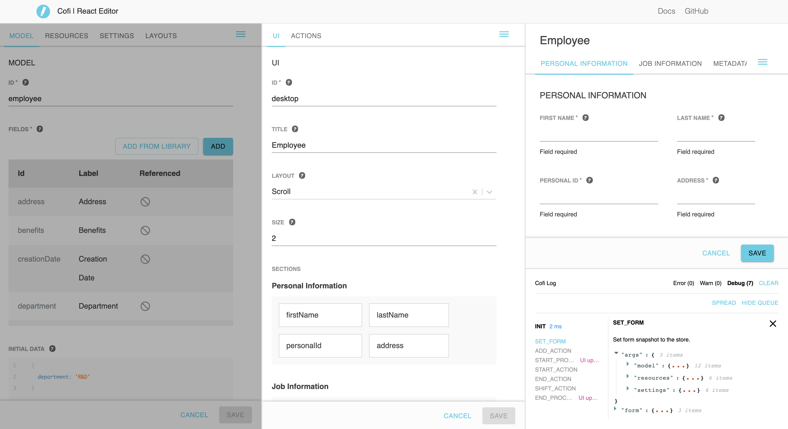

Online form editor let developers create, edit, preview, persist in a local storage and download - forms and layouts configurations.

Visit [Editor](https://galhavivi.github.com/cofi/demo-react-editor.html) to try it out.

## Configurations

Left area contains editing configurations of the form - model, resources, settings & layouts.

## Preview

Right area contains preview fields, and log view which updates on each preview change.

### Playground All

By default, all fields (which defined components) are rendered in the preview.

### Playground Relevant

When editing a field, only it and its relevant fields (such as dependant fields) are appear in the preview.

### Layout view

When editing a layout, the layout view and fields appear in the preview.

